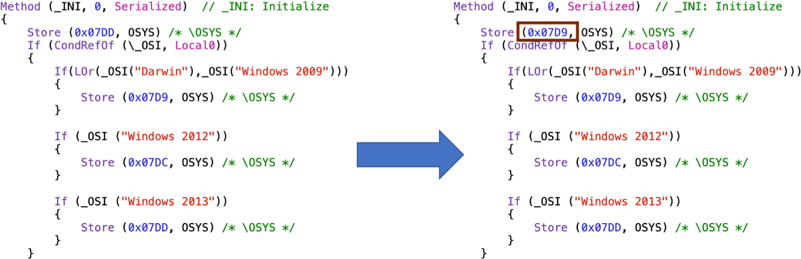
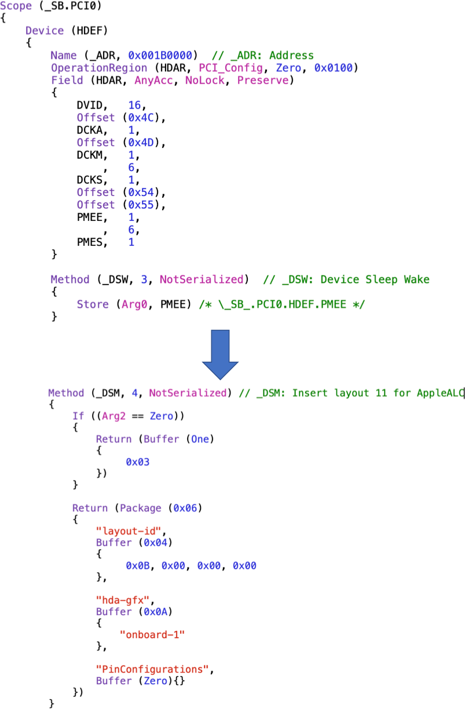
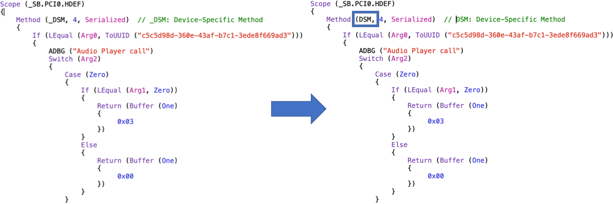

# ACPI DSDT Patching Guide

This directory contains all the information necessary to patch your DSDT for correct operation of your machine.

It is strongly recommended for you to extract the ACPI tables of your computer and apply the patches manually.

## Hotpatching (OpenCore recommended)

I am still working with creating the hot-patches (so that we don't need to load the entire DSDT as a patch).

The current hotpatches work, however:

- Battery level is always reported as 0% (AC power plug status is detected successfully)
- VoodooI2C crashes the system

### Patches applied

The patches that are applied to the DSDT are:
- Modified version of battery fix for HP G6 2221ss
- Windows 7 OS checks
- HPET, IRQ & RTC fixes
- Enable GPI0 Controllers

Brightness key fixes:

	# Brightness down
	into method label _Q10 replace_content begin 
	Notify(\_SB.PCI0.LPCB.PS2K, 0x0205)\n 
	Notify(\_SB.PCI0.LPCB.PS2K, 0x0285)\n 
	end; 

	# Brightness up
	into method label _Q11 replace_content begin
	Notify(\_SB.PCI0.LPCB.PS2K, 0x0206)\n 
	Notify(\_SB.PCI0.LPCB.PS2K, 0x0286)\n 
	end;
	
**NOTE:** I have combined all these patches in the `Patches.txt` file, just open that file from the Patch dialog in [MaciASL](https://github.com/acidanthera/MaciASL) and you're good to go.
	
Unfortunately, this is not the end of the story. You will need to do some manual hacking to resolve compiler issues and get audio to work:

### Fix "Result is not used, operator has no effect" error

Go to the line that causes the error and delete the line that contains `Not (Arg1)`.

### Default to Windows 7 Power Management

This particular implementation makes little use of the `_OSI` method. Instead, it detects the OS at startup and changes the value of the `OSYS` variable at init. The default (fallback) operation mode is for Windows 8.1. We want to change that to Windows 7:

### Insert ALC layout 11

Layout 3 also works, however, the microphone only works when ALC layout is set to 11. To insert layout 11, create the following `_DSM` method in `_SB.PCI0/HDEF`:

	Method (_DSM, 4, NotSerialized) // _DSM: Insert layout 11 for AppleALC
    {
    	If ((Arg2 == Zero))
        {
        	Return (Buffer (One)
            {
            	0x03
            })
        }

        Return (Package (0x06)
        {
        	"layout-id", 
            Buffer (0x04)
            {
            	0x0B, 0x00, 0x00, 0x00 
            }, 

            "hda-gfx", 
            Buffer (0x0A)
            {
            	"onboard-1"
            }, 

            "PinConfigurations", 
            Buffer (Zero){}
    	})
	}
	

	
### Rename original `_DSM` method for `HDEF` device

Navigate to `_SB.PCI0.HDEF`, and rename the `_DSM` method to `DSM`. This avoids the HDEF device to be switched automatically to I2S, which is not supported by macOS.

### System information

These patches where extracted from an HP Spectre x360 13-4101dx with BIOS version F54. Rev A.
