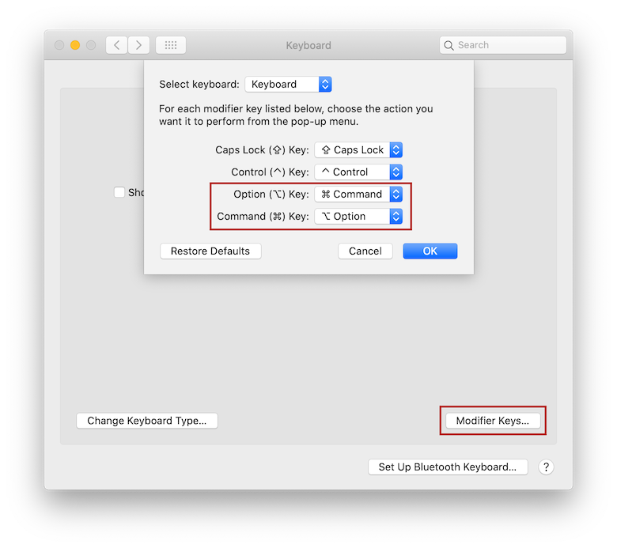
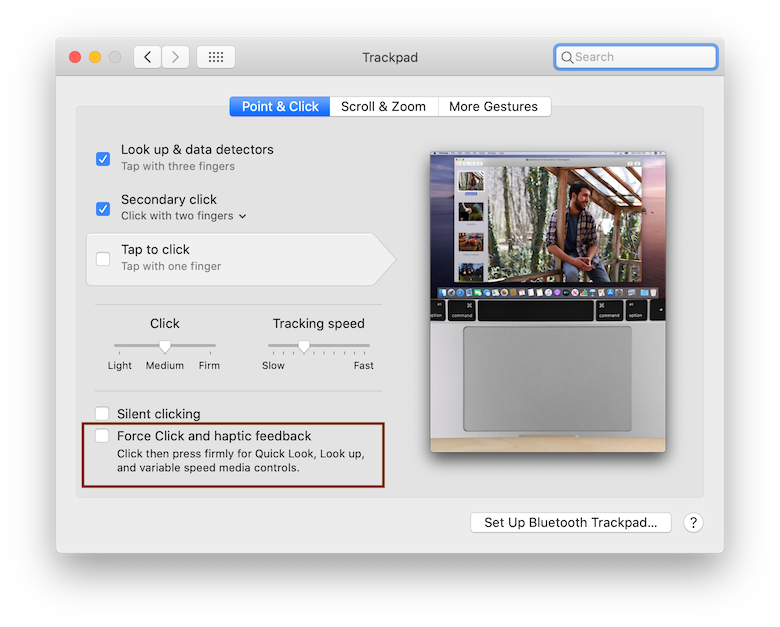

# macOS Catalina 10.15

### Tested versions:

- 10.15.5
- 10.15.6 (beta)

## What works:

- Display driver
- HiDPI configuration
- Touchpad (detected as Trackpad)
- Battery percentage
- Brightness, sound, airplane mode & other keyboard controls
- Intel WiFi via (itlwm, requires manual SSID/password injection in kext's info.plist)
- Internal SSD (it still hasn't burned out or something after one year with Hackintosh and 3+ years of Windows/Linux)
- Camera
- Bluetooth
- Audio via (VoodooHDA)

## In process

- Touchscreen
- Sleep

## Installation Guide

### What you'll need
- macOS installer (preferably from the App Store, don't use Niresh or other "distros", read [this](https://www.quora.com/Is-niresh-distro-recommended-in-the-hackintosh-community) and [this](https://www.reddit.com/r/hackintosh/comments/3sn6r1/why_is_niresh_bad/) for more information).
- An USB device.
- Access to your BIOS settings.

**<u>Note</u>**: If you don't have a Mac or another Hackintosh at hand, you can use [gibMacOS scripts](https://github.com/corpnewt/gibMacOS) to download the macOS installer directly from Apple.

### BIOS settings
- Use `F10` to boot into the BIOS setup screen.
- Disable fast boot and set the TPM Device to `hidden`.
- Enable legacy support, otherwise you may get weird issues with the display driver.
- If you haven't already, enable USB booting.

### USB Installer

1. Follow [CorpNewt's](https://github.com/corpnewt) excellent [Vanilla Installation Guide](https://hackintosh.gitbook.io/-r-hackintosh-vanilla-desktop-guide/) to get the macOS installer in your USB. **Skip the Clover installation**, we are going to use OpenCore.
2. Open the USB's EFI partition and replace the contents with the data inside the `EFI` folder. At this moment, you should be able to install macOS without any major issues. 

**Note:** if you have used Clover before, I strongly recommend you to clear the NVRAM settings before proceeding!

## Post Installation

### Fix swapped CMD/Option keys

The first time you boot the computer the `CMD` and `Option` keys will be switched. To fix this issue, open `Preferences/Keyboard/Modifier Keys` and switch the `CMD` and `Option` keys, be sure that you have selected `Keyboard` and not touch screen in the "Select Keyboard" combo box.

### Setup EFI partition

Mount your EFI partition, this can be done with the following terminal commands:

Copy the contents of the `EFI` folder to your system's `EFI` partition. 

### Fractional Scaling

To setup fractional scaling, use [One-Key HiDPI](https://github.com/xzhih/one-key-hidpi), which generates the appropriate configuration and allows you to configure HiDPI settings directly from the Preferences application.

**NOTE:** You may need to temporally disable SIP for the script to work.

### Disabling sleep

The computer is able to sleep, however, it automatically reboots after attempting to wake it. Since I rarely use this function, the quick and dirty solution was to disable sleep with the following commands:

    sudo pmset -a disksleep 0
    sudo pmset -a sleep 0
    sudo pmset -a hibernatemode 0
    sudo pmset -a disablesleep 1
    
    
### Fixing Trackpad behavior

Once that the trackpad preference pane is available, ensure that the "Force Click and haptic feedback" checkbox is disabled:

Once you set this, trackpad click should work as intended.
      
### WiFi Network management with HeliPort

The WiFi network card used by this laptop is supported by [itlwm](https://github.com/zxystd/itlwm). 

However, you will to manually specify the SSID & passwords of the networks you want to connect by modifying the `info.plist` file inside the `itlwm.kext` driver. 

You can also use [HeliPort](https://github.com/zxystd/HeliPort) to manage your WiFi connections with [itlwm](https://github.com/zxystd/itlwm) as a normal user with a normal life. However, the project is still in alpha stage. If you don't want to download Xcode, a build from 23/Jun/2020 is available [here](https://files.gitter.im/5ecde0a9d73408ce4fe4fe2d/jH7z/HeliPort_23_06.zip).

## KEXTs

These files are included in the `EFI` folder of this repository, however, I believe that it's good practice to list them and their download sources:

- VirtualSMC ([https://github.com/acidanthera/VirtualSMC](https://github.com/acidanthera/VirtualSMC))
- Lilu ([https://github.com/acidanthera/Lilu](https://github.com/acidanthera/Lilu))
- VoodooPS2 ([https://github.com/acidanthera/VoodooPS2](https://github.com/acidanthera/VoodooPS2))
- WhateverGreen ([https://github.com/acidanthera/WhateverGreen](https://github.com/acidanthera/WhateverGreen))
- ~AppleALC ([https://github.com/acidanthera/AppleALC](https://github.com/acidanthera/AppleALC))~ (audio works, microphone doesn't)
- VoodoHDA ([https://github.com/chris1111/VoodooHDA-2.9.2-Clover-V15](https://github.com/chris1111/VoodooHDA-2.9.2-Clover-V15))
- itlwm ([https://github.com/zxystd/itlwm](https://github.com/zxystd/itlwm))

