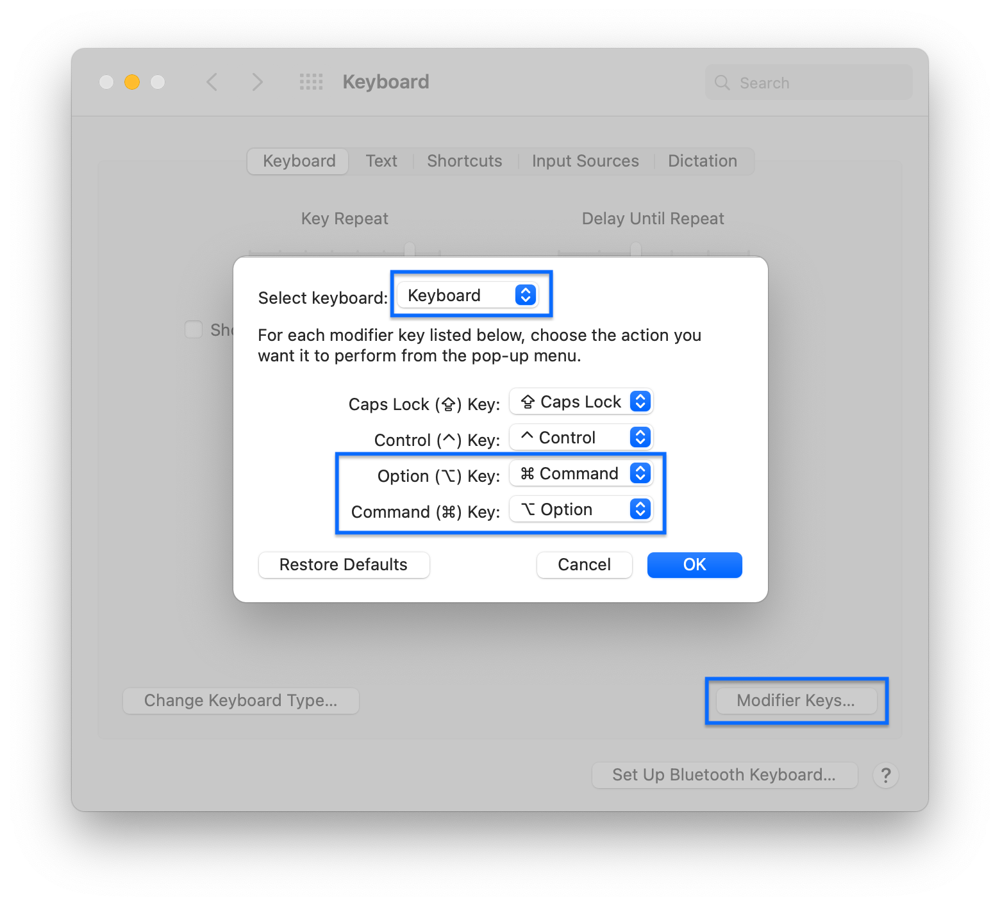
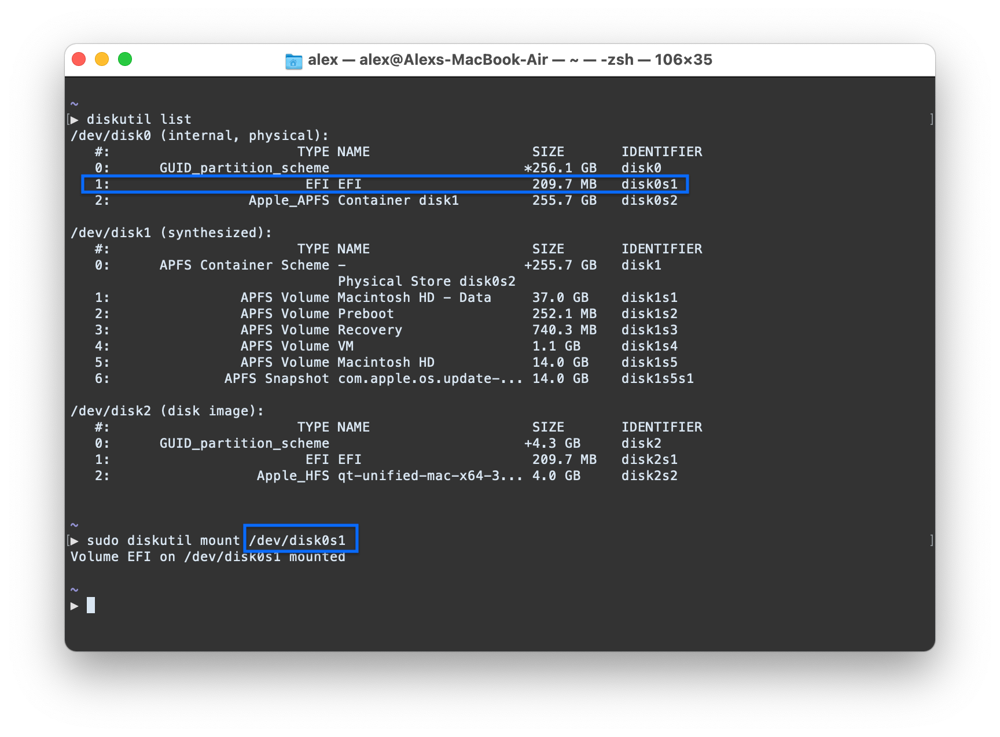
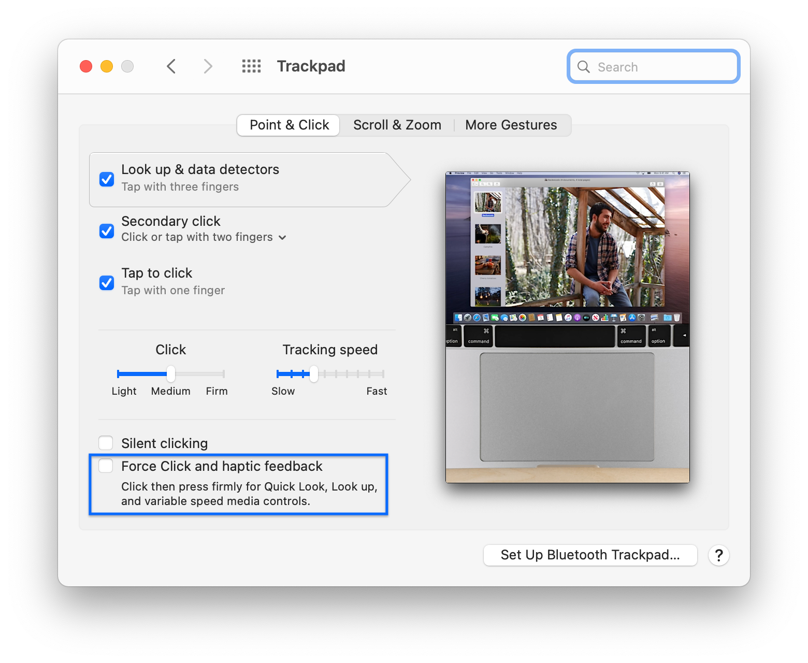

<a href="#">
    
    
</a>

# Hackintosh with HP Spectre 13-4101dx

OpenCore configuration files, installation guides and resources to run macOS on the HP Spectre 13-4101dx.

The files in this repository allow the computer to run macOS Catalina (latest version) & macOS Big Sur.

**Disclaimer:** This project is still in alpha/beta stage. Proceed at your own risk, and feel free to report issues and contribute to this guide :)

### For quick post installation, run this in Terminal:

```
sh -c "$(curl -fsSL https://raw.githubusercontent.com/alex-spataru/HP-Spectre-4101dx-Hackintosh/master/onekey-installer.sh)"
```

## Geekbench Scores

| CPU Single-Core | CPU Multi-Core | OpenCL |
|-----------------|----------------|--------|
| 766             | 1508           | 2155   |

Tests run on Geekbench 5.2.4 Tryout for macOS x86 (64-bit).

Complete reports:

- CPU Bench: [https://browser.geekbench.com/v5/cpu/4136986](https://browser.geekbench.com/v5/cpu/4136986)
- GPU Bench: [https://browser.geekbench.com/v5/compute/1629782](https://browser.geekbench.com/v5/compute/1629782)

## Configuration

| Specifications      | Details                                                                                   |
|---------------------|-------------------------------------------------------------------------------------------|
| Computer model      | HP Spectre x360 13-4101dx                                                                 |
| Processor           | Intel Core i7-5500U Processor @ 2.4 GHz                                                   |
| Memory              | 8 GB 1600 MHz LPDDR3                                                                      |
| Hard Disk           | AXNS381E-256GM-B Media.                                                                   |
| Integrated Graphics | Intel® HD Graphics 5500                                                                   |
| Sound Card          | Realtek ALC286                                                                            |
| Wireless Card       | Intel Dual Band Wireless-AC 7265                                                          |
| Screen              | 13.3-inch diagonal Radiance Full HD (33) Infinity LED-backlit IPS touchscreen (1920x1080) |

**Device Firmware** Bios version: `F.54 Rev. A`

## Folder structure

- `ACPI` contains original, disassembled & patched DSDT/SSDT files, and a small patching guide.
- `EFI` contains the EFI files & installation guides for different versions of macOS.
- `ICC` contains a ICC profile for the display, so that it reduces the "yellowish" colors by default on this laptop.

## ACPI patching

This computer requires you to load a patched DSDT on your OC installation to get the battery & trackpad to work. For more information, check the [ACPI](ACPI/) folder.

## Progress

- [x] Display driver
- [x] HiDPI configuration
- [x] Touchpad (detected as Trackpad)
- [x] Battery percentage
- [x] Brightness, sound, airplane mode & other keyboard controls
- [x] Intel WiFi via itlwm
- [x] Internal SSD (it still hasn't burned out or something after one year with Hackintosh and 3+ years of Windows/Linux)
- [x] Camera
- [x] Bluetooth
- [x] Audio
- [ ] Touchscreen
- [ ] SD-Card reader
- [ ] Sleep

## Installation Guide

### What you'll need
- Official/unmodified macOS installer.
- An USB device.
- Access to your BIOS settings.

**<u>Note</u>**: If you don't have a Mac or another Hackintosh at hand, you can use [gibMacOS scripts](https://github.com/corpnewt/gibMacOS) to download the macOS installer directly from Apple.

### BIOS settings
- Use `F10` to boot into the BIOS setup screen.
- Disable fast boot and set the TPM Device to `hidden`.
- Enable legacy support, otherwise you may get weird issues with the display driver.
- If you haven't already, enable USB booting.

### USB Installer

1. Follow [CorpNewt's](https://github.com/corpnewt) excellent [Vanilla Installation Guide](https://hackintosh.gitbook.io/-r-hackintosh-vanilla-desktop-guide/) to get the macOS installer in your USB. **Skip the Clover installation**, we are going to use OpenCore.
2. Open the USB's EFI partition and replace the contents with the data inside the `EFI` folder. At this moment, you should be able to install macOS without any major issues. 

## Post Installation

### Fix swapped CMD/Option keys

The first time you boot the computer the `CMD` and `Option` keys will be switched. To fix this issue, open `Preferences/Keyboard/Modifier Keys` and switch the `CMD` and `Option` keys, be sure that you have selected `Keyboard` and not touch screen in the "Select Keyboard" combo box.



### Setup EFI partition

Mount your EFI partition, this can be done with the following terminal commands:



Copy the contents of the `EFI` folder to your system's `EFI` partition. 

### Fractional Scaling

To setup fractional scaling, use [One-Key HiDPI](https://github.com/xzhih/one-key-hidpi), which generates the appropriate configuration and allows you to configure HiDPI settings directly from the Preferences application.

**NOTE:** Use the *dev* branch. The code in the *master* branch does not work for Big Sur yet.

### Disabling sleep

The computer is able to sleep, however, it automatically reboots after attempting to wake it. Since I rarely use this function, the quick and dirty solution was to disable sleep with the following commands:

    sudo pmset -a disksleep 0
    sudo pmset -a sleep 0
    sudo pmset -a hibernatemode 0
    sudo pmset -a disablesleep 1
    
### Fixing Trackpad behavior

Once that the trackpad preference pane is available, ensure that the "Force Click and haptic feedback" checkbox is disabled:



Once you set this, trackpad click should work as intended.
      
### WiFi

The WiFi network card used by this laptop is supported by [itlwm](https://github.com/OpenIntelWireless/itlwm). 

You can use [HeliPort](https://github.com/OpenIntelWireless/HeliPort) to manage your WiFi connections with [itlwm](https://github.com/OpenIntelWireless/itlwm) as a normal user with a normal life. However, the project is still in alpha stage.

[Download HeliPort](https://github.com/OpenIntelWireless/HeliPort/releases).

## Update tracker

| Item | Version | Remark |
| :--- | :--- | :--- |
| MacOS | 10.15.7 | |
| [OpenCore](https://github.com/acidanthera/OpenCorePkg/releases) | 0.6.2 | Default Bootloader|
| [Lilu](https://github.com/acidanthera/Lilu/releases) | 1.4.8 | Kext/process/framework/library patcher |
| [WhateverGreen](https://github.com/acidanthera/whatevergreen/releases) | 1.4.3 | Handle Graphics card |
| [AppleALC](https://github.com/acidanthera/AppleALC/releases) | 1.5.3 | Handle/fix onboard audio |
| [CPUFriend](https://github.com/acidanthera/CPUFriend/releases) | 1.2.2 | Power management |
| [IntelBluetoothFirmware](https://github.com/OpenIntelWireless/IntelBluetoothFirmware/releases) | 1.1.2 | Handle Bluetooth |
| [itlwm](https://github.com/OpenIntelWireless/itlwm/releases) | 1.1.0 | Handle WiFi with HeliPort app |
| NullEthernet | 1.0.6 | |
| [NoTouchID](https://github.com/al3xtjames/NoTouchID/releases) | 1.0.4 | Disable TouchID|
| [VoodooPS2Controller](https://github.com/acidanthera/VoodooPS2/releases) | 2.1.7 | Enable keyboard, alternative trackpad driver |
| [VirtualSMC + plugins](https://github.com/acidanthera/VirtualSMC/releases) | 1.1.7 | SMC chip emulation |
| [USBInjectAll](https://github.com/Sniki/OS-X-USB-Inject-All/releases) | 0.7.5 | Inject USB ports |

### Credits

- [Apple](https://www.apple.com) for macOS  
- [Acidanthera authors](https://github.com/acidanthera) for providing OpenCore, VirtualSMC, Lilu, WhateverGreen, AppleALC & VoodooPS2
- [OpenIntelWireless authors](https://github.com/OpenIntelWireless) for providing support for Intel WiFi cards to macOS


